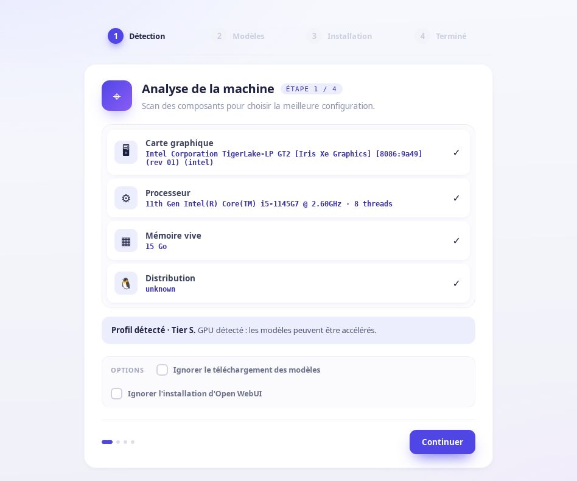
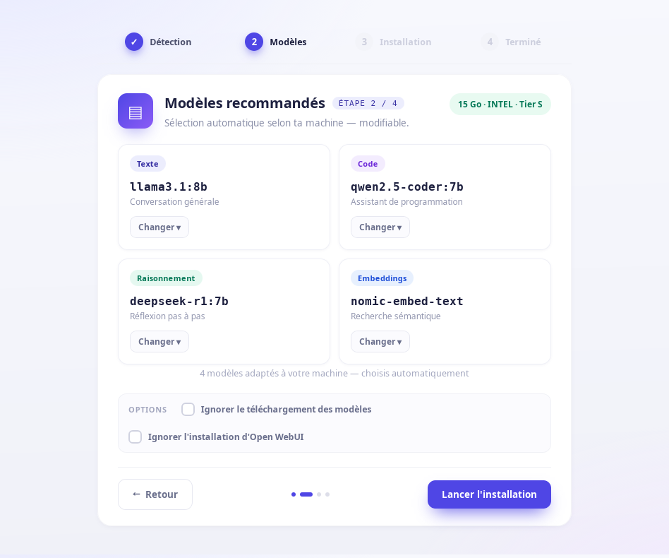
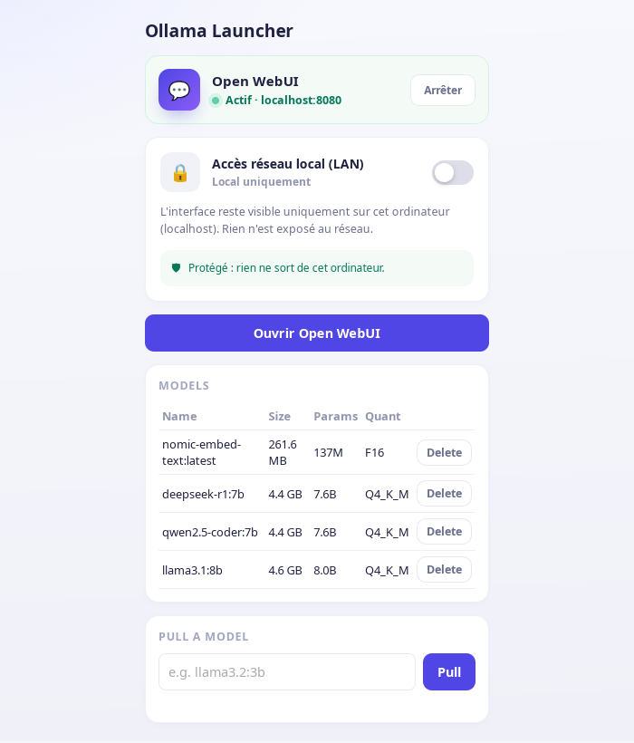

# SelfLlama

Run your own private AI assistant, entirely on your own computer — no subscription, no cloud, no data ever leaving your machine. This project installs and configures everything for you: [Ollama](https://ollama.com) to run the AI models, and [Open WebUI](https://github.com/open-webui/open-webui) as a ChatGPT-style chat interface, with models automatically chosen to fit your computer's hardware.

It works on both Linux and Windows, either through a graphical installer (no terminal needed) or a set of scripts for those who prefer the command line.

## Screenshots

<table>
<tr>
<td width="50%"><br/><sub><b>Installer assistant</b> — detects your GPU, CPU, RAM and picks a model tier automatically.</sub></td>
<td width="50%"><br/><sub><b>Model selection</b> — one model per use case (text, code, reasoning, embeddings), auto-picked, changeable.</sub></td>
</tr>
<tr>
<td colspan="2"><br/><sub><b>Launcher</b> — day-to-day companion app: start/stop Open WebUI, manage installed models, share network access via a QR code.</sub></td>
</tr>
</table>

## Get started

The simplest way to get started is the desktop app: download the installer for your platform, run it, and it walks you through detecting your hardware and picking models — no terminal required.

- **[Download the installer](https://github.com/Mvth1s/ollama-configuration/releases)** for your platform and format (`.deb`/`.rpm`/`.AppImage` on Linux, `.msi`/`.exe` on Windows), or browse them visually on the **[showcase site](https://ollama-configuration.vercel.app/#download)**.
- **Arch Linux**: build a native package instead of using the `.AppImage` — see [`packaging/arch/README.md`](packaging/arch/README.md). This links against your system's own `webkit2gtk`/`gtk3` rather than the copies bundled in the AppImage, which have been reported to crash on launch on at least one Arch-based system with an AMD GPU.
- Once installed, [`launcher/`](launcher/README.md) (SelfLlama Launcher) is the app you'll actually use day-to-day afterwards: open the chat interface, start/stop the service, manage models, and share access on your local network.

Prefer the command line, or want more control over each step? See [Quick start (command line)](#quick-start-command-line) below — everything the desktop app does is just a thin wrapper around the same scripts.

More detail on both apps: [`gui/README.md`](gui/README.md) (installer) and [`launcher/README.md`](launcher/README.md) (day-to-day companion).

## Quick start (command line)

### Requirements

- Linux (Arch, Debian/Ubuntu, Fedora, openSUSE — other distros require manual GPU driver installation)
- `curl`, `bash` ≥ 4.0 (for associative arrays)
- `sudo` privileges for package installation and systemd configuration

```bash
git clone https://github.com/Mvth1s/ollama-configuration.git
cd ollama-configuration
./scripts/linux/setup.sh
```

The web interface is then available at **http://localhost:8080**.

## Options

```bash
./scripts/linux/setup.sh                   # full install, auto-detection
./scripts/linux/setup.sh --tier=M          # force a specific model tier (XS / S / M / L)
./scripts/linux/setup.sh --skip-models     # install Ollama + GPU + WebUI without models
./scripts/linux/setup.sh --skip-webui      # skip Open WebUI installation
./scripts/linux/setup.sh --no-tui          # disable the interactive dialog/whiptail menus
```

## Interactive mode (TUI)

When run in an interactive terminal with `dialog` or `whiptail` installed, and no explicit `--tier=`, `02-configure-gpu.sh` and `03-pull-models.sh` show interactive menus instead of the plain text prompts: a yes/no dialog to confirm the Nvidia driver install, and a per-usage menu (text/code/reasoning/embeddings) to pick among 2-3 candidate models instead of the tier's single default.

Neither `dialog` nor `whiptail` is a hard requirement. If neither is installed, or the script is not run in an interactive terminal (chained through `setup.sh` unattended, or in a script/CI), the scripts fall back to the existing plain prompts and default models automatically. Pass `--no-tui` to force that fallback even in an interactive terminal.

## Individual steps

Each script can be re-run on its own without reinstalling everything:

```bash
./scripts/linux/01-install-ollama.sh                          # install Ollama and start the service
./scripts/linux/02-configure-gpu.sh [--no-tui]                # detect GPU and configure acceleration
./scripts/linux/03-pull-models.sh [--tier=XS|S|M|L] [--no-tui] # download models
./scripts/linux/04-install-webui.sh                           # install Open WebUI
```

## Model tiers

The tier is chosen automatically based on available RAM — you don't need to pick one yourself; the table below is just for reference, or to override it with `--tier=`.

| Tier | RAM | Text | Code | Reasoning | Embeddings |
|------|-----|------|------|-----------|------------|
| XS | ≤ 8 GB | llama3.2:3b | qwen2.5-coder:3b | deepseek-r1:1.5b | nomic-embed-text |
| S | ≤ 16 GB | llama3.1:8b | qwen2.5-coder:7b | deepseek-r1:7b | nomic-embed-text |
| M | ≤ 32 GB | gemma3:12b | devstral:24b | deepseek-r1:14b | nomic-embed-text |
| L | > 32 GB | gemma3:27b | qwen2.5-coder:32b | deepseek-r1:32b | nomic-embed-text |

On CPU-only machines (no dedicated GPU), the tier is capped at S regardless of RAM.

## GPU support

Also automatic — detected and configured for you. Reference table:

| Vendor | Backend | Notes |
|--------|---------|-------|
| Nvidia | CUDA | No per-card configuration needed. |
| AMD | ROCm/HIP | Automatically falls back to Vulkan + `HSA_OVERRIDE_GFX_VERSION` for RDNA4 chips not yet officially supported by ROCm. |
| Intel | Vulkan (Mesa ANV) | Best effort — covers Xe/Iris iGPUs and Arc dedicated GPUs. Falls back to CPU silently if unsupported. |
| None | CPU | No configuration needed. |

## Useful commands after installation

```bash
ollama list                            # list installed models
ollama run llama3.1:8b                 # run a model from the terminal
systemctl status ollama                # Ollama service status
systemctl --user status open-webui     # Open WebUI service status
```

To start Open WebUI without an active user session:
```bash
sudo loginctl enable-linger $USER
```

## Windows installation

A separate, native PowerShell implementation (`scripts\windows\setup.ps1` + `scripts\windows\lib\common.ps1`), not a port of the Bash scripts and not meant to run under WSL:

```powershell
git clone https://github.com/Mvth1s/ollama-configuration.git
cd ollama-configuration
.\scripts\windows\setup.ps1
```

Options:

```powershell
.\scripts\windows\setup.ps1                     # full install, auto-detection
.\scripts\windows\setup.ps1 -Tier M             # force a specific model tier (XS / S / M / L)
.\scripts\windows\setup.ps1 -SkipModels         # install Ollama + Open WebUI without models
.\scripts\windows\setup.ps1 -SkipWebui          # skip Open WebUI installation
```

Same RAM-based tier auto-selection and model tables as the table above. GPU handling is intentionally minimal: the official Ollama Windows installer already detects CUDA and ROCm natively, so the script only detects the GPU vendor (same PCI vendor IDs as the Linux scripts) to log it, and warns if an AMD GPU may fall outside ROCm's officially supported list on Windows.

Open WebUI is installed via `pip`/`pipx` and run through a per-user scheduled task (`OpenWebUI`, triggered at logon) instead of a systemd service, at the same `http://localhost:8080`.

```powershell
ollama list                    # list installed models
Get-ScheduledTask OpenWebUI    # Open WebUI task status
```

## Security note

Open WebUI is installed with **no login** (`WEBUI_AUTH=False`) — anyone who can reach it can chat and manage models without authenticating. To limit the blast radius of that, it also listens on **`127.0.0.1` only by default**: nothing outside the machine itself can reach it, regardless of `WEBUI_AUTH`.

If you want to reach it from another device on your network (e.g. a phone), enable LAN access at any time, on or off, without reinstalling anything:

```bash
./scripts/linux/toggle-webui-lan.sh on       # reachable from your local network
./scripts/linux/toggle-webui-lan.sh off      # back to this machine only (default)
./scripts/linux/toggle-webui-lan.sh status   # show the current setting
```

```powershell
.\scripts\windows\toggle-webui-lan.ps1 on
.\scripts\windows\toggle-webui-lan.ps1 off
.\scripts\windows\toggle-webui-lan.ps1 status
```

Turning LAN access **on** prints a warning every time, because `WEBUI_AUTH` stays `False`: once reachable from the network, anyone on it can use Open WebUI, including pulling/deleting models, without logging in. If that's not acceptable for your network, enable login instead of (or in addition to) LAN access:

- Linux: edit `Environment="WEBUI_AUTH=False"` to `"True"` in `~/.config/systemd/user/open-webui.service`, then `systemctl --user daemon-reload && systemctl --user restart open-webui`.
- Windows: `[Environment]::SetEnvironmentVariable('WEBUI_AUTH', 'True', 'User')`, then restart the `OpenWebUI` scheduled task.
- Create an account on your next visit to `http://localhost:8080` — the first account created becomes the admin.

## Desktop apps and showcase site

Packaged installers (`.deb`/`.rpm`/`.AppImage`/`.msi`/`.exe`) for both `gui/` and `launcher/` are attached to [GitHub Releases](https://github.com/Mvth1s/ollama-configuration/releases) — built and published automatically by CI on every release.

A showcase site for the project (`docs/index.html`) is live at **[ollama-configuration.vercel.app](https://ollama-configuration.vercel.app)**, with a `#download` section linking directly to the latest release's installer files per app/platform/format; `vercel.json` at the repo root points Vercel at the `docs/` folder. Deploys are automatic via Vercel's own Git integration (no GitHub Actions workflow involved): every push gets a preview deployment, and the production domain updates as soon as a change lands on `main`.

## Contributing

The sections below are for contributors working on this repo itself — skip them if you're just installing and using the project.

### Linting

Bash scripts are checked with [ShellCheck](https://www.shellcheck.net/) ([`.github/workflows/lint.yml`](.github/workflows/lint.yml)). Run the same check locally, from within `scripts/linux/` itself (not the repo root — ShellCheck resolves each script's `source lib/common.sh` relative to its own working directory):

```bash
cd scripts/linux
shellcheck -x *.sh lib/*.sh
```

`scripts/windows/setup.ps1`/`scripts/windows/lib/common.ps1`/`scripts/windows/toggle-webui-lan.ps1` are checked the same way with [PSScriptAnalyzer](https://github.com/PowerShell/PSScriptAnalyzer):

```powershell
Install-Module -Name PSScriptAnalyzer -Scope CurrentUser
Invoke-ScriptAnalyzer -Path scripts/windows/setup.ps1, scripts/windows/lib/common.ps1, scripts/windows/toggle-webui-lan.ps1
```

### Tests

[`tests/`](tests/) holds a [bats](https://github.com/bats-core/bats-core) suite covering `scripts/linux/lib/common.sh` and the tier/GPU-vendor/LAN-toggle logic in the numbered scripts (all under `scripts/linux/`). Every test runs against a throwaway `$HOME` and a stubbed `PATH` (see [`tests/test_helper.bash`](tests/test_helper.bash)), so it never touches the real package manager, systemd, or network — safe to run on your own machine, not just in CI:

```bash
bats tests/*.bats
```

`gui/` and `launcher/` each have a handful of `#[cfg(test)]` unit tests (repo-root discovery, Ollama API response mapping):

```bash
cd gui/src-tauri && cargo test       # or launcher/src-tauri
```

Both suites run via [`.github/workflows/test.yml`](.github/workflows/test.yml); [`.github/workflows/rust-ci.yml`](.github/workflows/rust-ci.yml) additionally runs `cargo clippy`/`cargo build` for `gui/`/`launcher/`, and [`.github/workflows/e2e.yml`](.github/workflows/e2e.yml) drives the real compiled app windows through WebdriverIO — so a broken build or a UI regression is no longer only caught at release time.

[`.github/workflows/ci.yml`](.github/workflows/ci.yml) is the single entry point for all of the above on every push and pull request: it runs `lint`+`test` first, then `rust-ci`+`e2e` only once those pass, so a broken shellcheck/bats run doesn't waste time on a full Tauri build. It skips entirely on doc-only changes (`**/*.md`, `docs/**`); [`.github/workflows/docs-lint.yml`](.github/workflows/docs-lint.yml) separately runs a syntax check on `docs/index.html`'s own inline script, since that one file has real JS despite living under `docs/`.

## License

[MIT](LICENSE)
